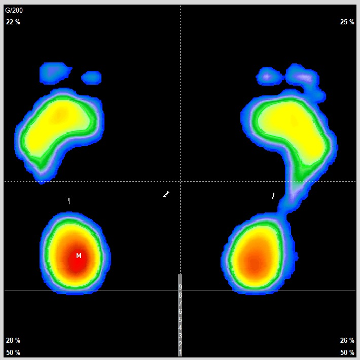
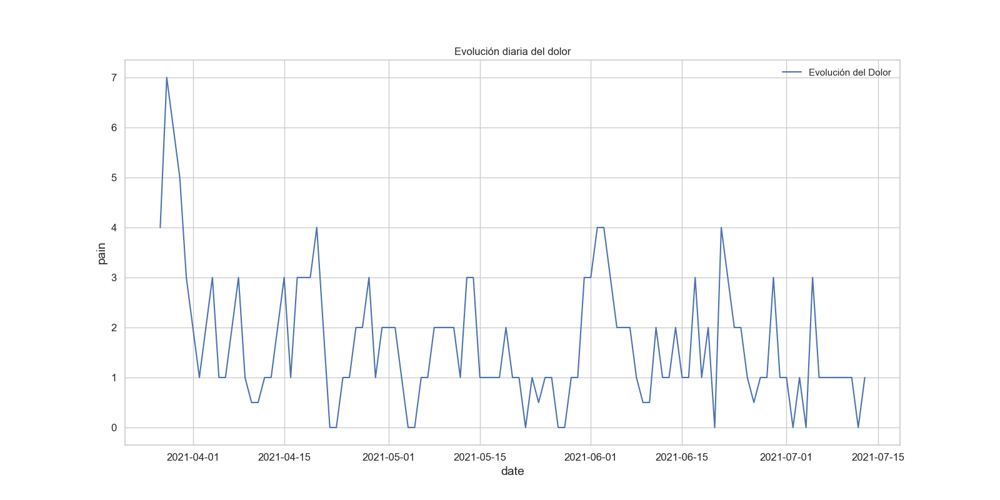
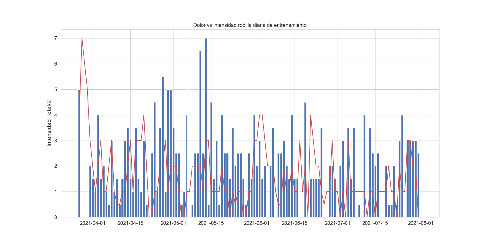
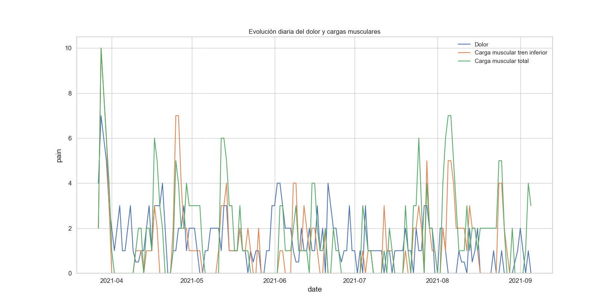
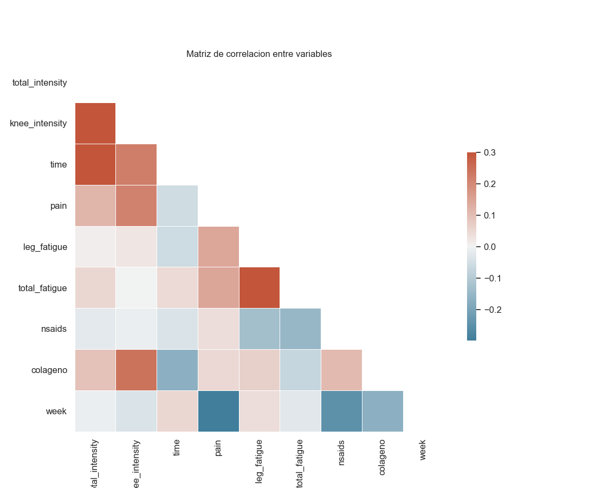

[](https://github.com/psf/black)
[](https://opensource.org/licenses/MIT)
[](https://github.com/cmougan/WRI_WellBeing_Data_Layer)

# Tratamiento de dolor de condromalacia

## Cuadro Clínico

### Resonacias Magnéticas
#### 10/11/2020
__Hallazgos__

No se identifica patrón de edema óseo.\
Los ligamentos cruzados y colaterales están integros.\
No se observan alteraciones significativas los meniscos.\
Lesion condral leve en la superficie de carga de la meseta tibial externa.\
No existen alteraciones en el ángulo posterolateral ni en el resto de las estructuras capsulares.\
La articulación femoropatelar es congruente con ligera basculzacion anterior de la rótula.\
El cartílago rotuliano presenta un aumento de señan en T2 que traduce edema fundamentalmetne en la cresta interfacetaria asociadad a fisuras qeu no afectan al hueso subcondral.\
No existen alteraciones significativas en el cartílago del surco troclear. \
Se observa un engrosamiento del tendón cuadricipital descartándose la presencia de discontinuidad del mismo.\
El tendón rotuliano es de aspecto normal. \
No existe derrame articular en cantidad valorable.\

**Conclusión**

Condomalacia rotuliana grado II-III. Engrosamiento del tendón cuadricipital.\
No existen alteraciones significativas del tendón rotuliano. \
Lesión condral de inicio en la meseta tibial externa.\

### Podología (Análisis de la pisada)
 Por Rafael Gonzales Clinici San Sebastian de los Reyes
 
 
 Se observa que el mayor punto de apoyo es en el talón del pié izquierdo. 
 Del pie derecho la zona del metatarso del dedo gordo falta presión.
 
__Tratamiento:__ Añadir una leve correción en la plantilla del pie derecho[21/4/2021]. (A los zapatos de CF)
 Más imágenes en (_images/podologo_)
 

### Tratamiento

#### Infiltracion PRP
28/01/2021

Efecto: Ausencia de dolor durante las 4 semanas siguientes. 
Aumento de la carga de entrenamiento a niveles anteriores: CF y Kite. 
Pasadas las primeras 4 semanas el dolor vuelve de forma diferente y con mayor intensidad.

## Metodología de evaluación

### Evaluacion del dolor
```
1: Sensaciones extrañas leves en momentos puntuales del día. 
2: Sensaciones extrañas en momentos puntuales del día.
3: Presión constante a lo largo del día.
4: Presión constante a lo largo del día, con momentos de dolor agudo.
5: Cojera al andar. 
6: El dolor me despierta por la noche
7: Dolor que dificulta el andar.
```

### Evaluación de la fatiga muscular.
```
1: Músculo levemente activo y tenso
2: Músculo activo y tenso
3: Leve tensión muscular y pérdida de la movilidad. 
5: Agujetas
10: Cuesta salir de la cama.
```


## Análisis Exploratorio de Datos


## Carga deportiva
<!-- [Deporte Acumulado](images/deporte.png "Title") -->






## Correlacción de variables




#### Bibliografía

[1] Platelet-rich plasma therapy:https://www.health.harvard.edu/newsletter_article/platelet-rich-plasma-therapy

[2] Cirugía de implante de condrocitos autólogos en rodilla: https://fondoscience.com/reaca/vol28-fasc1-num71/fs2002012-cirugia-implante-condrocitos-autologos-rodilla

[3] Role of Platelet-Rich Plasma in Articular Cartilage Injury and Disease https://www.thieme-connect.com/products/ejournals/html/10.1055/s-0034-1384672

[4] Chondromalacia Patellae: https://www.physio-pedia.com/Chondromalacia_Patellae
