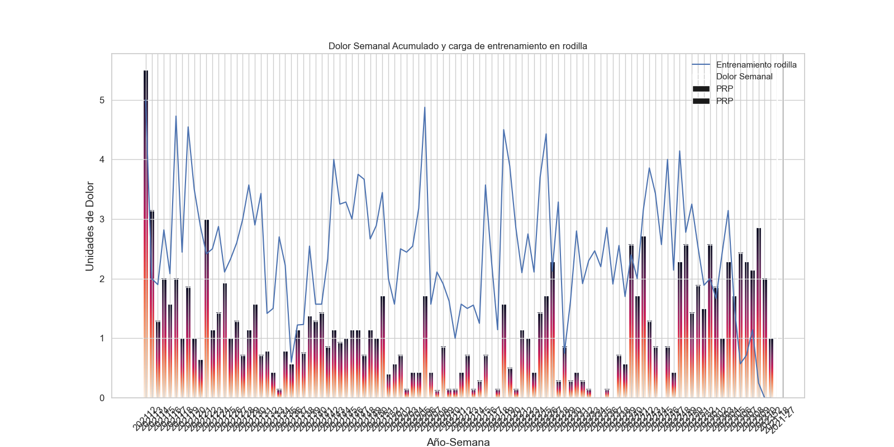
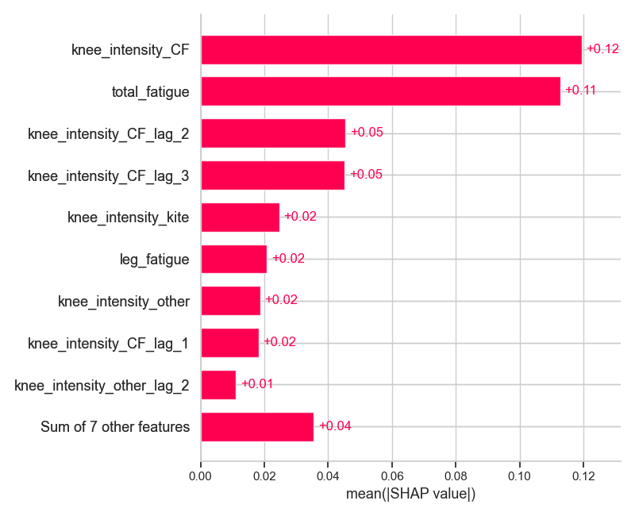
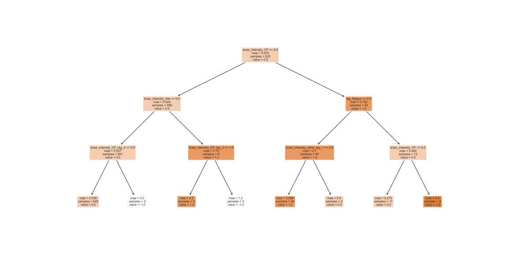
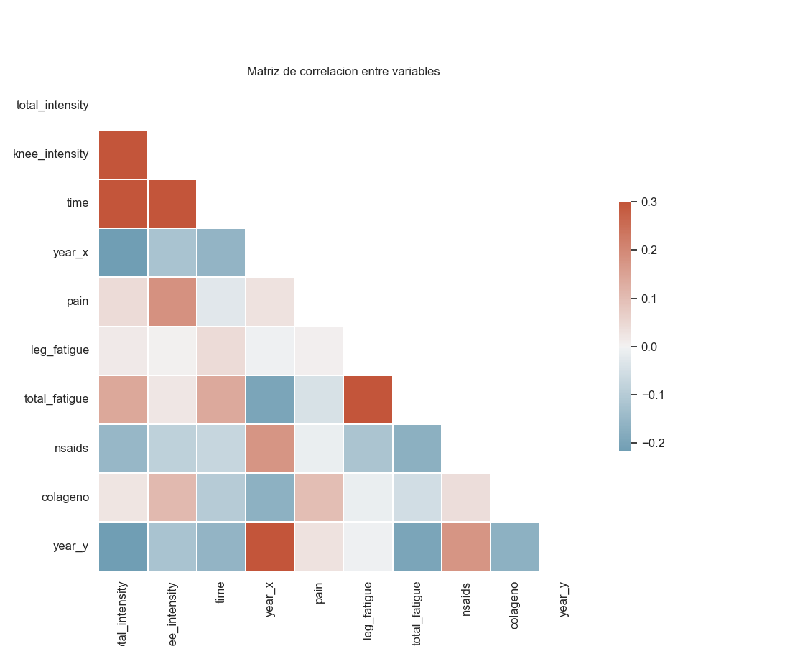

[](https://github.com/psf/black)
[](https://opensource.org/licenses/MIT)
[](https://github.com/cmougan/WRI_WellBeing_Data_Layer)

# Tratamiento de dolor de condromalacia

## Cuadro Clínico

### Resonacias Magnéticas
#### 10/11/2020

__Hallazgos__

No se identifica patrón de edema óseo.\
Los ligamentos cruzados y colaterales están integros.\
No se observan alteraciones significativas los meniscos.\
Lesion condral leve en la superficie de carga de la meseta tibial externa.\
No existen alteraciones en el ángulo posterolateral ni en el resto de las estructuras capsulares.\
La articulación femoropatelar es congruente con ligera basculzacion anterior de la rótula.\
El cartílago rotuliano presenta un aumento de señan en T2 que traduce edema fundamentalmetne en la cresta interfacetaria asociadad a fisuras qeu no afectan al hueso subcondral.\
No existen alteraciones significativas en el cartílago del surco troclear. \
Se observa un engrosamiento del tendón cuadricipital descartándose la presencia de discontinuidad del mismo.\
El tendón rotuliano es de aspecto normal. \
No existe derrame articular en cantidad valorable.\

**Conclusión**

Condomalacia rotuliana grado II-III. Engrosamiento del tendón cuadricipital.\
No existen alteraciones significativas del tendón rotuliano. \
Lesión condral de inicio en la meseta tibial externa.\
[Link al estudio](https://portaldelpaciente.htmedica.com/PortalPaciente/OpenSharedStudyRequest/dfbd3888-b691-41c4-a605-e3a2757bfac8)

### 27/07/2021

__HALLAZGOS__

Menisco medial con signos de degeneración mixoide del cuerno posterior. Menisco lateral
de morfología e intensidad de señal dentro de la normalidad.
Compartimento femorotibial medial con interlínea articular conservada, no observando
edema óseo ni líneas de fractura.
Mínima fibrilación del cartílago de la zona de carga del platillo tibial lateral.
Articulación femoropatelar congruente con patela de inserción normal. Fibrilación con
algunas fisuras de espesor completo del cartílago del tercio medio de la cresta y carilla
patelar medial, sin afectación del hueso subcondral. Tróclea de morfología dentro de la
normalidad con leve elongación de los valores de T2 del cartílago de la vertiente lateral.
Retináculos íntegros.
Tendón del cuádriceps y patelar sin hallazgos reseñables.
Ligamentos cruzados y colaterales de grosor y disposición dentro de la normalidad.
No se observa derrame articular en cuantía significativa. Pequeño quiste de Baker no
complicado.

**CONCLUSION**
Condropatía patelar difusa grado II-III. Condropatía troclear grado I.

[Link al estudio](https://portaldelpaciente.htmedica.com/PortalPaciente/OpenSharedStudyRequest/dfbd3888-b691-41c4-a605-e3a2757bfac8)


### Podología (Análisis de la pisada)
 Por Rafael Gonzales Clinica San Sebastian de los Reyes
 
 
 Se observa que el mayor punto de apoyo es en el talón del pié izquierdo. 
 Del pie derecho la zona del metatarso del dedo gordo falta presión.
 
__Tratamiento:__ Añadir una leve correción en la plantilla del pie derecho[21/4/2021]. (A los zapatos de CF)
 Más imágenes en (_images/podologo_)
 

### Tratamiento

#### Infiltracion PRP
**28/01/2021**

Efecto: Ausencia de dolor durante las 4 semanas siguientes. 
Aumento de la carga de entrenamiento a niveles anteriores: CF y Kite. 
Pasadas las primeras 4 semanas el dolor vuelve de forma diferente y con mayor intensidad.
De forma más estructural e interna en la rodilla

**6/5/2021**

Efecto: Disminución del dolor en las 3-4 semanas posteriores a la infiltración.
A la 4 semana dejé de tomar CarticurePlus y hubo un pico de dolor durante el periodo que no consumí carticure (1s)
Al final del informe se aporta visualización y test estadístico sobre los efectos -- No concluyente.


**6/7/2021**
Efecto: Disminucion del dolor en las 4 semanas posteriores.


## Metodología de evaluación

### Evaluacion del dolor
```
1: Sensaciones extrañas leves en momentos puntuales del día. 
2: Sensaciones extrañas en momentos puntuales del día.
3: Presión constante a lo largo del día.
4: Presión constante a lo largo del día, con momentos de dolor agudo.
5: Cojera al andar. 
6: El dolor me despierta por la noche
7: Dolor que dificulta el andar.
```

### Evaluación de la fatiga muscular.
```
1: Músculo levemente activo y tenso
2: Músculo activo y tenso
3: Leve tensión muscular y pérdida de la movilidad. 
5: Agujetas
7: Músculo hiper fatigado que con calentamiento vuelve a una normalidad funcional.
9: Músculo fatigado que aún con calentamiento no vuelve a su normalidad funcional
10: Rotura de fibras grave.
```


## Análisis Exploratorio de Datos



## Modelización
En esta sección se usa un modelo estadístico para modelizar el problema.
A continuación se utilizan técnicas de explicación para encontrar patrones.

En la imagen inferior se puede ver la contribución total de cada variable
a las predicciónes del modelo


En la imagen inferior se pueden observar la cada contribucióon por dia y variable
de cada instancia.


En la siguiente imagen se muestra un arbol de decisión. 
Las primeras divisiones son suelen tener mayor importancia.


La correlacion entre algunas de las variables recogidas la


# Analisis deportivo realizado

<!-- 
## Efecto diario del colágeno


## Carga deportiva
[Deporte Acumulado](images/deporte.png "Title") 


## Distribution Dolor Pre-Post PRP
Gráfico de distribución del dolor antes y despues de la prp


--->
#### Bibliografía

[1] Platelet-rich plasma therapy:https://www.health.harvard.edu/newsletter_article/platelet-rich-plasma-therapy

[2] Cirugía de implante de condrocitos autólogos en rodilla: https://fondoscience.com/reaca/vol28-fasc1-num71/fs2002012-cirugia-implante-condrocitos-autologos-rodilla

[3] Role of Platelet-Rich Plasma in Articular Cartilage Injury and Disease https://www.thieme-connect.com/products/ejournals/html/10.1055/s-0034-1384672

[4] Chondromalacia Patellae: https://www.physio-pedia.com/Chondromalacia_Patellae
