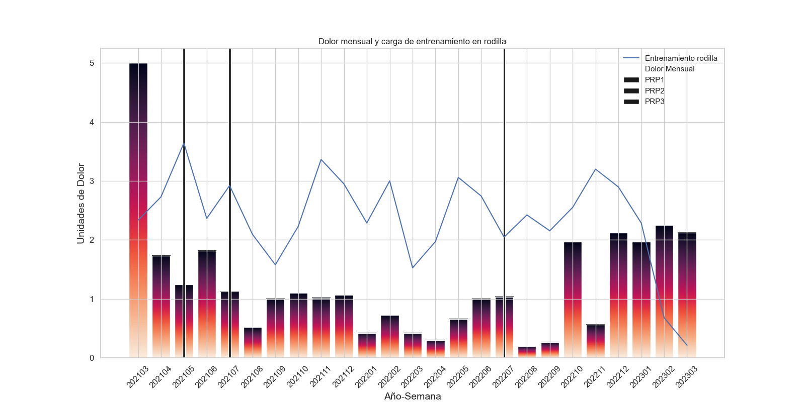
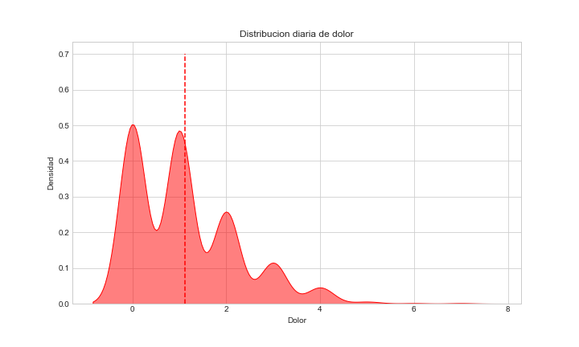
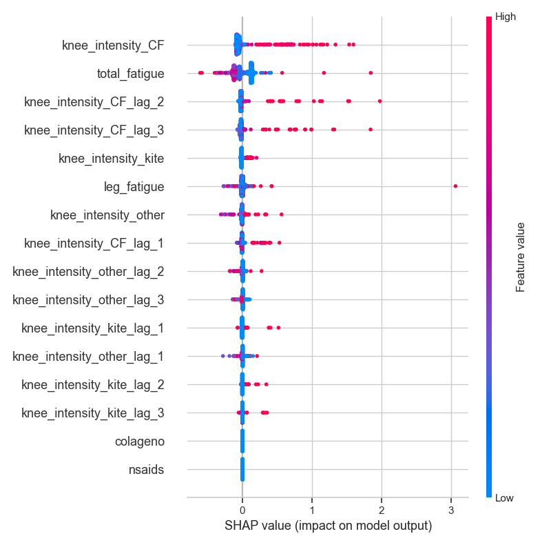
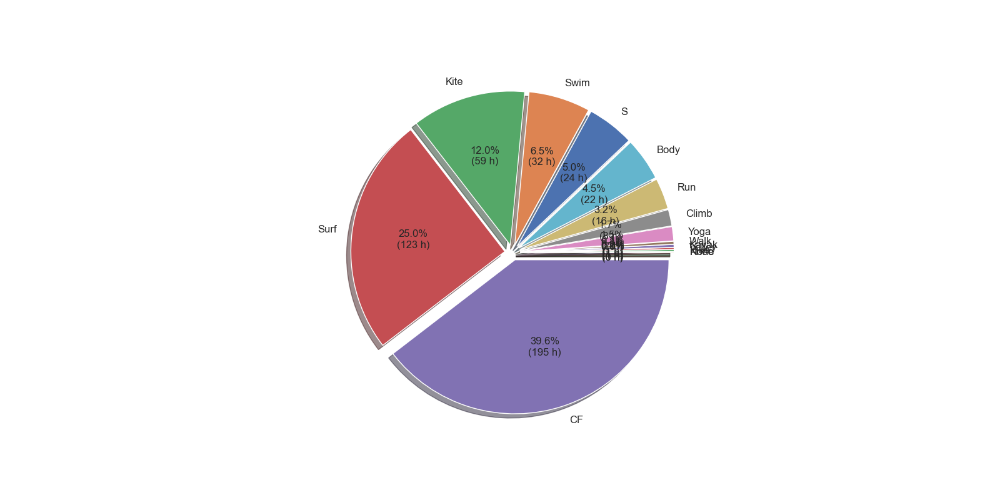
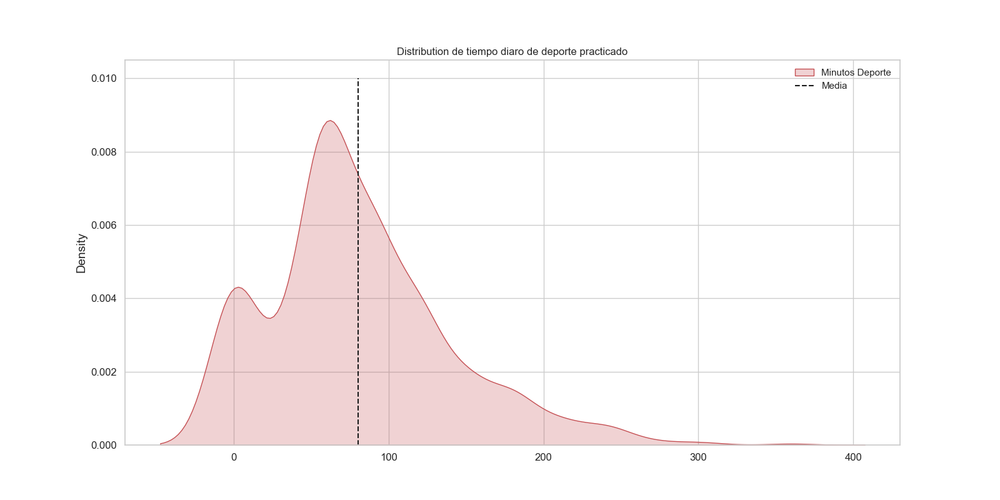
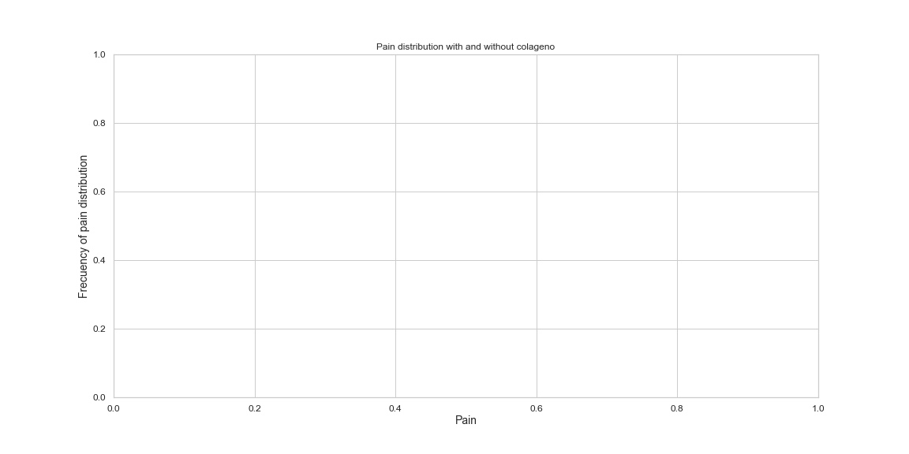
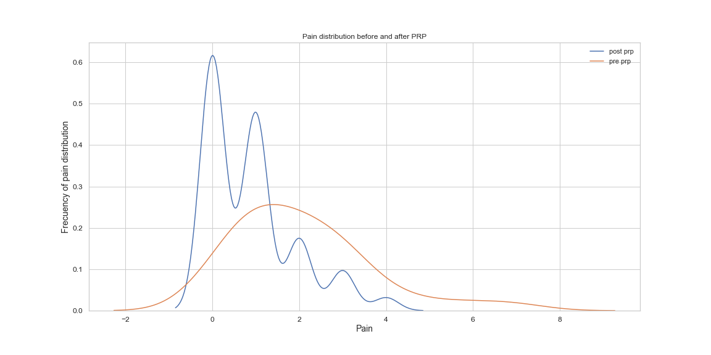

[](https://github.com/psf/black)
[](https://opensource.org/licenses/MIT)
[](https://github.com/cmougan/WRI_WellBeing_Data_Layer)

# Dolor de rodilla
Resumen: este estudio presenta un resumen autoelaborado por Carlos Mougan para el estudio y análisis del dolor de rodilla.

La estructura es la siguiente:
 - 1. Sintomas
 - 2. Cuadro clinico con las resonancias magnéticas en la rodilla y conclusión por el radiólog.
 - 3. Analisis de la pisada.
 - 4. Infiltraciones de PRP con fechas y analisis del efecto.
 - 5. Escala de evaluacion del dolor
 - 6. Monitorización con visualizaciones y analisis de datos del desarrollo temporal.

## Sintomas
### Actualmente
Tengo dolor a diario cuasi constantemente con picos de dolor alto. El dolor me suele despertar por la noche. Si es un pico deo dolor alto cojeo al andar. 

Hay posiciones de la rodilla en reposo que me duelen. 
El dolor desaparece tras calentar. A veces el dolor articular viene asociado a atrofia muscular en el gemelo (poplideo).

Debido a una operacion en el hombro a final de Enero'23 no hago deporte. Dejar de hacer deporte no ha disminuido la cantidad de dolor.

La rodilla derecha cruje y hace ruido al doblarla. La rodilla izquierda no cruje. 
Hace mas ruido en la extension de cuadriceps que en la contracción (sentadilla).

#### Tratamiento actual
Entreno en el gimnasio fuerza de piernas evitando añadir tensión al cuadriceps. Estiro biceps femoral, isquiotibiables y gemelos 4-5 días a la semana. 

PRP el 23 Febrero de 2023.
### Historial de sintomático
Hasta 2017 me dediqué a nadar, sin ningún problema. A finales de 2017 empeze a CrossFit.

En 2019 empeze a tener una sensación gelatinosa despues de entrenar en el tendón rotuliano que aparecía con una pequeña inflamación temporal. Acudí al traumatólogo (Noviembre 2020) y me recomendó rehabilitacion y una PRP (Febrero 2021). Ver Resonancia Magnética 1.

<p align="center">
  
</p>

En los tres meses siguientes (Diciembre'20, Enero'21, Febrero '21) aprendí a hacer KiteSurf y empezó a aparecer el dolor de rodilla.
En Febrero me hice la PRP y el dolor  gelationoso y las post-inflamación desapareció por completo y practique mucho Kitesurf y CrossFit.

A las 3-4 semanas de la PRP, aparecío un nuevo dolor MUY intenso. Pero en otra zona diferente. Un dolor mas interno de la rodilla.

<p align="center">
  
</p>

Pasado dos o tres semanas, el dolor disminuyo y me hice otra PRP. El dolor aparecía principalmente despues de hacer CrossFit y era incomodo y a veces alto, pero en general tolerable.

 Este dolor se ha mantendio constante durante dos años, hasta hace 4 meses.

 Desde hace 4 meses duele constantemente, independientemente de hacer deporte o no. 
 Consecuencia, he dejado de hacer deporte. Y me cuesta estar mucho tiempo de pié o en la calle.

<p align="center">
  
</p>

 **Conclusion** Incremento del dolor durante los ultimos 3-4 años: sensacion ligamenton rotuliano (2años), dolor interno leve-intermedio (2 años), dolor intermedio-intenso (4meses)

## Preguntas
- Por que en RM1 solo hay "sensacion gelatinosa" tras hacer deporte y en RM3 hay dolor constante?
- Es la "sensacion gelatinosa" el mismo problema que el dolor articular?

#### Mis hipotesis.
Estas son mis hypotésis:

 - **A.** Son dolores diferentes. Del primero la PRP me recuperó. El segundo es una lesión condral generada por micro-traumatismos de aprender Kite.
  
 - **B.** Es una progresión de dolor debido a un fallo estructural biomecánico.
## Cuadro Clínico
Los resultados de las resonancias se puede ver en esta carpeta local [Link](https://github.com/cmougan/knee/tree/main/RMresults)

### Resonacias Magnética: **10/11/2020**

Hallazgos: No se identifica patrón de edema óseo.\
Los ligamentos cruzados y colaterales están integros.\
No se observan alteraciones significativas los meniscos.\
Lesion condral leve en la superficie de carga de la meseta tibial externa.\
No existen alteraciones en el ángulo posterolateral ni en el resto de las estructuras capsulares.\
La articulación femoropatelar es congruente con ligera basculzacion anterior de la rótula.\
El cartílago rotuliano presenta un aumento de señan en T2 que traduce edema fundamentalmetne en la cresta interfacetaria asociadad a fisuras qeu no afectan al hueso subcondral.\
No existen alteraciones significativas en el cartílago del surco troclear. \
Se observa un engrosamiento del tendón cuadricipital descartándose la presencia de discontinuidad del mismo.\
El tendón rotuliano es de aspecto normal. \
No existe derrame articular en cantidad valorable.\

**Conclusión**

Condomalacia rotuliana grado II-III. Engrosamiento del tendón cuadricipital.\
No existen alteraciones significativas del tendón rotuliano. \
Lesión condral de inicio en la meseta tibial externa.\
[Link al estudio](https://portaldelpaciente.htmedica.com/PortalPaciente/OpenStudyByKeyRequest?id=3ploViv1PT0%3d)


### Resonacias Magnética: **27/07/2021**

Hallazgos: Menisco medial con signos de degeneración mixoide del cuerno posterior. Menisco lateral
de morfología e intensidad de señal dentro de la normalidad.
Compartimento femorotibial medial con interlínea articular conservada, no observando
edema óseo ni líneas de fractura.
Mínima fibrilación del cartílago de la zona de carga del platillo tibial lateral.
Articulación femoropatelar congruente con patela de inserción normal. Fibrilación con
algunas fisuras de espesor completo del cartílago del tercio medio de la cresta y carilla
patelar medial, sin afectación del hueso subcondral. Tróclea de morfología dentro de la
normalidad con leve elongación de los valores de T2 del cartílago de la vertiente lateral.
Retináculos íntegros.
Tendón del cuádriceps y patelar sin hallazgos reseñables.
Ligamentos cruzados y colaterales de grosor y disposición dentro de la normalidad.
No se observa derrame articular en cuantía significativa. Pequeño quiste de Baker no
complicado.

**CONCLUSION**
Condropatía patelar difusa grado II-III. Condropatía troclear grado I.

### Resonacias Magnética: **10/1/2023**
Esta resonancia tiene T2 mapping
[Link al estudio](https://portaldelpaciente.htmedica.com/PortalPaciente/OpenStudyByKeyRequest?id=SY0xSHdgN0o%3d)

HALLAZGOS:
No se observa derrame articular.
No se aprecian alteraciones de la señal de los elementos óseos incluidos.
Los ligamentos cruzados y colaterales están íntegros.
No se identifican alteraciones significativas en ambos compartimentos femorotibiales, ni
en los meniscos.
La articulación femoropatelar es congruente. Signos de fibrilación con aumento de señal
T2 del cartílago patelar, sin defectos condrales francos, ni edema del hueso subcondral.
No existen alteraciones significativas en el aparato extensor.

**CONCLUSION**
Condromalacia rotuliana grado II-III, sin cambios significativos respecto a previo.
### Podología (Análisis de la pisada)
 Por Rafael Gonzales Clinica San Sebastian de los Reyes
 
 
 Se observa que el mayor punto de apoyo es en el talón del pié izquierdo. 
 Del pie derecho la zona del metatarso del dedo gordo falta presión.
 
__Tratamiento:__ Añadir una leve correción en la plantilla del pie derecho[21/4/2021]. (A los zapatos de CF)
 Más imágenes en (_images/podologo_)
 

### Tratamiento: Infiltracion PRP
**28/01/2021**

Efecto: Ausencia de dolor durante las 4 semanas siguientes. 
Aumento de la carga de entrenamiento a niveles anteriores: CF y Kite. 
Pasadas las primeras 4 semanas el dolor vuelve de forma diferente y con mayor intensidad.
De forma más estructural e interna en la rodilla

**6/5/2021**

Efecto: Disminución del dolor en las 3-4 semanas posteriores a la infiltración.
A la 4 semana dejé de tomar CarticurePlus y hubo un pico de dolor durante el periodo que no consumí carticure (1s)
Al final del informe se aporta visualización y test estadístico sobre los efectos -- No concluyente.


**6/7/2021**
Efecto: Disminucion del dolor en las 4 semanas posteriores.


**7/7/2022**
Efecto: Disminucion del dolor en las 4 semanas posteriores.


## Metodología de evaluación

### Evaluacion del dolor
```
1: Leves molestias en momentos puntuales del día. 
2: Molestias en momentos puntuales del día.
3: Presión constante a lo largo del día.
4: Presión constante a lo largo del día, con momentos de dolor agudo.
5: Cojera al andar. 
6: El dolor me despierta por la noche
7: Dolor que dificulta el andar.
```

### Evaluación de la fatiga muscular.
```
1: Músculo levemente activo y tenso
2: Músculo activo y tenso
3: Leve tensión muscular y pérdida de la movilidad. 
5: Agujetas
7: Músculo hiper fatigado que con calentamiento vuelve a una normalidad funcional.
9: Músculo fatigado que aún con calentamiento no vuelve a su normalidad funcional
10: Rotura de fibras grave.
```


## Análisis del Dolor
En esta primera imagen se puede observar $(i)$ las barras el dolor mensual medio de cada día, siguiendo la escala de evaluacion de dolor, $(ii)$ la gráfica azul, representa la media del nivel medio de carga de entrenamiento de la rodilla y $(iii)$ las lines verticales negras las inyecciones de PRP que se han realizado. 


En esta imagen se puede ver una distribucion del dolor, lo más frequente es dolor 0 o 1. El 60% de los días de los 2 ultimos años ha habido dolor. El 12% de los días ha habido un dolor superior a 2, que implica un dolor agudo. 


## Modelización
En esta sección se usa un modelo estadístico para intentar predecir el dolor diario dado los datos proporcionado. A continuación se utilizan técnicas de explicación para encontrar patrones.

En la imagen inferior se puede ver la contribución total de cada variable
a las predicciónes del modelo, un mayor valur implicar una mayor importancia a la hora de predecir la cantidad de dolor diario.


En la imagen inferior se pueden observar la cada contribución por dia y variable
de cada instancia. Los valores mas hacia la derecha implican que ha habido una mayor contribución de la variable al dolor.


La correlacion entre algunas de las variables recogidas la


# Analisis deportivo realizado
La siguiente figura representa la cantidad de deporte realizado durante los dos últimos años. El deporte más practicado es el CrossFit seguido del Surf.


En esta imagen se puede ver la distribución de la cantidad de deporte diaria que practico. Con una media de 90 mins de deporte diario. Es posible calcular la fracción de deporte diario que practico multiplicando por 90 mins por un $36\%$ de Crossfit diario sale entorno 30 mins diario. Nota, están incluidos los 365 días del año. 


<!-- 
## Efecto diario del colágeno


## Carga deportiva
[Deporte Acumulado](images/deporte.png "Title") 


## Distribution Dolor Pre-Post PRP
Gráfico de distribución del dolor antes y despues de la prp




--->
#### Bibliografía

[1] Platelet-rich plasma therapy:https://www.health.harvard.edu/newsletter_article/platelet-rich-plasma-therapy

[2] Cirugía de implante de condrocitos autólogos en rodilla: https://fondoscience.com/reaca/vol28-fasc1-num71/fs2002012-cirugia-implante-condrocitos-autologos-rodilla

[3] Role of Platelet-Rich Plasma in Articular Cartilage Injury and Disease https://www.thieme-connect.com/products/ejournals/html/10.1055/s-0034-1384672

[4] Chondromalacia Patellae: https://www.physio-pedia.com/Chondromalacia_Patellae

[5] Das, P., Jana, S., & Kumar Nandi, S. (2022). Biomaterial‐Based Therapeutic Approaches to Osteoarthritis and Cartilage Repair Through Macrophage Polarization. The Chemical Record, 22(9), e202200077.https://onlinelibrary.wiley.com/doi/full/10.1002/tcr.202200077?casa_token=S67L5pbY-UQAAAAA%3Ad2lsOYsq32vQPyAgLjdinxHxCRIVzuXD4Wb1Ih_ru-nYzH1wwzOz36nQOa5sDdJmYAZ6hdL9pz9t

[6] Tuan RS, Chen AF, Klatt BA. Cartilage regeneration. J Am Acad Orthop Surg. 2013 May;21(5):303-11. doi: 10.5435/JAAOS-21-05-303. PMID: 23637149; PMCID: PMC4886741. https://www.ncbi.nlm.nih.gov/pmc/articles/PMC4886741/

[7] Unlike Bone, Cartilage Regeneration Remains Elusive. Science 2012 https://www.science.org/doi/full/10.1126/science.1222454?casa_token=sGJgo9EN1WsAAAAA%3AJgWTXN05c9nkUoN4sOz_Iaov1iCPKEXmgo8s5RfJRJiFZDiJm3NUaHnPXbemJKMCxmhXF-Jsvhcp

[8] Knee Pain Diagnosis https://www.knee-pain-explained.com/knee-pain-diagnosis.html

[9] Failure of cartilage regeneration: emerging hypotheses and related therapeutic strategies. Nature Reviews Rheumatology https://www.nature.com/articles/s41584-023-00979-5

[10] The synovial environment steers cartilage deterioration and regeneration. Science Advances. https://www.science.org/doi/full/10.1126/sciadv.ade4645